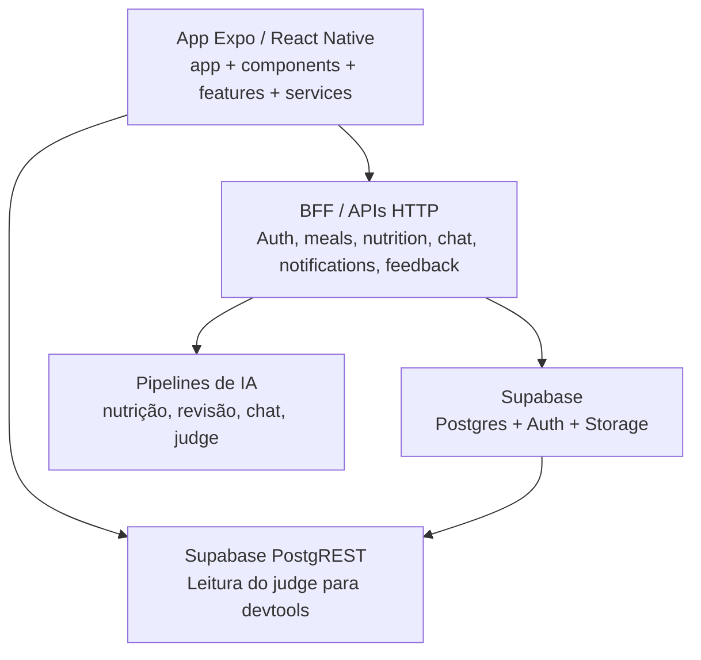
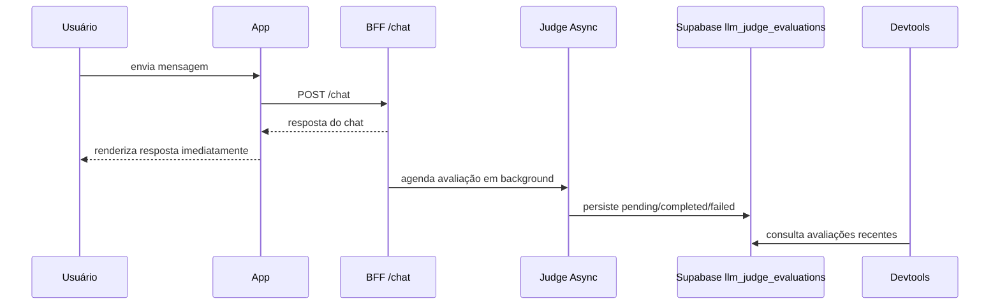

<p align="center">
  
</p>

<h1 align="center">VidaSync</h1>

<p align="center">
  <strong>Diário alimentar inteligente com IA, acompanhamento diário e ferramentas internas de observabilidade.</strong>
  <br />
  Aplicativo mobile em Expo + React Native para registro alimentar, hidratação, revisão assistida, chat, favoritos, histórico e métricas de desenvolvedor.
</p>

<p align="center">
  
  
  
  
  
  
</p>

<p align="center">
  
  
  
  
</p>

---

## Sumário

- [Visão geral](#visão-geral)
- [Estado atual do produto](#estado-atual-do-produto)
- [Arquitetura](#arquitetura)
- [Experiências principais do app](#experiências-principais-do-app)
- [Mapa de rotas](#mapa-de-rotas)
- [Estrutura do repositório](#estrutura-do-repositório)
- [Stack técnica](#stack-técnica)
- [Como rodar localmente](#como-rodar-localmente)
- [Configuração e variáveis de ambiente](#configuração-e-variáveis-de-ambiente)
- [Integrações e contratos esperados](#integrações-e-contratos-esperados)
- [Observabilidade de desenvolvedor e LLM-as-Judge](#observabilidade-de-desenvolvedor-e-llm-as-judge)
- [Testes e qualidade](#testes-e-qualidade)
- [Build, release e OTA](#build-release-e-ota)
- [Documentação auxiliar](#documentação-auxiliar)
- [Contribuição](#contribuição)
- [Licenciamento](#licenciamento)

---

## Visão geral

O **VidaSync** é um aplicativo mobile focado em rotina alimentar e acompanhamento pessoal. O repositório atual concentra o **frontend Expo/React Native**, enquanto o backend fica em serviços externos consumidos pelo app.

O app foi desenhado para combinar:

- registro manual e assistido de refeições
- análise por foto, áudio e PDF
- revisão assistida antes de confirmar dados sensíveis
- hidratação, metas nutricionais e histórico
- chat com o agente **Fitty**
- observabilidade técnica para equipe de produto e desenvolvimento

> Este repositório é o cliente mobile. Ele integra com BFF/APIs externas para autenticação, nutrição, chat, notificações, feedback e observabilidade.

---

## Estado atual do produto

| Área | O que existe hoje |
| --- | --- |
| Home | resumo diário, hidratação, metas, refeições, pull-to-refresh, notificações |
| Refeições | registro manual, edição, exclusão, fluxo de revisão assistida |
| IA nutricional | análise de foto, áudio e PDF com fallback de revisão |
| Histórico | navegação por data, panorama de progresso e análise de água |
| Favoritos | pratos salvos com imagem e reutilização |
| Chat | conversa com o agente Fitty |
| Notificações | central, contador, detalhe full-screen e ações |
| Feedback | envio de feedback e centro interno/admin |
| Devtools | logs de rede, métricas híbridas, leitura do judge no Supabase |
| Saúde | calculadora de IMC e cards de apoio |

### Destaques recentes

- Tela inicial com `pull-to-refresh` e rolagem corrigida.
- Detalhe de notificação refatorado para exibição full-screen.
- Chat com nome do agente padronizado como **Fitty**.
- Dashboard de desenvolvedor consumindo **LLM-as-Judge** diretamente do banco.

---

## Arquitetura



### Fluxo do chat com judge assíncrono



### Fontes de dados do app

| Fonte | Papel |
| --- | --- |
| BFF principal | auth, refeições, favoritos, chat, notificações, feedback e métricas |
| Serviços especializados | áudio, PDF e revisão podem usar bases/paths próprios |
| Supabase | auth, storage, dados do judge e storage de mídia, conforme backend |
| Sessão local do app | logs de rede e telemetria fallback para o devtools |

---

## Experiências principais do app

### 1. Home

Tela principal do produto, centrada no dia atual:

- resumo de metas e progresso
- cards de hidratação
- refeições por bloco do dia
- atalhos para registro por texto, foto e áudio
- pull-to-refresh manual
- acesso a perfil e notificações

Arquivos centrais:

- [`app/(tabs)/index.tsx`](app/(tabs)/index.tsx)
- [`features/home/use-home-screen.ts`](features/home/use-home-screen.ts)
- [`features/home/home-hero-card.tsx`](features/home/home-hero-card.tsx)
- [`features/home/home-hydration-card.tsx`](features/home/home-hydration-card.tsx)

### 2. Registro assistido por mídia

Fluxos preparados para enviar arquivos ao backend com preview, retry e estados por item:

- foto de refeição
- áudio para análise nutricional
- PDF de plano alimentar

Arquivos centrais:

- [`components/attachments/attachment-picker-field.tsx`](components/attachments/attachment-picker-field.tsx)
- [`components/nutrition/photo-nutrition-analyzer.tsx`](components/nutrition/photo-nutrition-analyzer.tsx)
- [`components/nutrition/audio-nutrition-analyzer.tsx`](components/nutrition/audio-nutrition-analyzer.tsx)
- [`components/nutrition/pdf-plan-analyzer.tsx`](components/nutrition/pdf-plan-analyzer.tsx)
- [`services/attachments.ts`](services/attachments.ts)

### 3. Revisão assistida

Quando o backend retorna `needsReview` / `precisa_revisao`, o app abre um fluxo de revisão antes da confirmação final.

Hoje o padrão de revisão cobre:

- nutrição
- plano alimentar
- extensões futuras de chat ou outros pipelines

Arquivos centrais:

- [`app/review/assistida.tsx`](app/review/assistida.tsx)
- [`app/nutrition/review.tsx`](app/nutrition/review.tsx)
- [`app/plan/review.tsx`](app/plan/review.tsx)
- [`features/review/nutrition-review-editor.tsx`](features/review/nutrition-review-editor.tsx)
- [`features/review/plan-review-editor.tsx`](features/review/plan-review-editor.tsx)

### 4. Histórico, panorama e água

O app tem uma visão histórica mais analítica além da timeline simples:

- histórico por data
- panorama de progresso
- visualização específica de hidratação

Arquivos centrais:

- [`app/(tabs)/history.tsx`](app/(tabs)/history.tsx)
- [`app/progress-panorama.tsx`](app/progress-panorama.tsx)
- [`app/water-analysis.tsx`](app/water-analysis.tsx)
- [`features/history/history-panorama-screen.tsx`](features/history/history-panorama-screen.tsx)

### 5. Favoritos

Módulo de pratos salvos reutilizáveis:

- cadastro com imagem
- busca
- reutilização em novos registros
- fluxo de edição/exclusão

Arquivos centrais:

- [`app/(tabs)/explore.tsx`](app/(tabs)/explore.tsx)
- [`features/explore/explore-favorites-list.tsx`](features/explore/explore-favorites-list.tsx)
- [`services/favorites.ts`](services/favorites.ts)

### 6. Chat com Fitty

Experiência conversacional do app:

- histórico por `conversationId`
- normalização de payload camelCase/snake_case
- mensagens e memória de conversa
- preparação para quick actions

Arquivos centrais:

- [`app/(tabs)/chat.tsx`](app/(tabs)/chat.tsx)
- [`features/chat/chat-screen.tsx`](features/chat/chat-screen.tsx)
- [`services/chat.ts`](services/chat.ts)
- [`components/chat/chat-quick-actions.tsx`](components/chat/chat-quick-actions.tsx)

### 7. Notificações

Módulo completo de notificações:

- central com unread count
- marcar como lida
- deletar
- detalhe em tela cheia
- imagem, conteúdo e rota de ação

Arquivos centrais:

- [`components/notifications/notification-center-modal.tsx`](components/notifications/notification-center-modal.tsx)
- [`components/notifications/notification-detail-modal.tsx`](components/notifications/notification-detail-modal.tsx)
- [`services/notifications.ts`](services/notifications.ts)

### 8. Devtools e observabilidade

Hub interno para time técnico:

- logs de rede da sessão
- métricas locais por interceptação de `fetch`
- merge com endpoints remotos `/metrics/*`
- leitura do judge no Supabase para o dashboard de qualidade

Arquivos centrais:

- [`app/(tabs)/devtools.tsx`](app/(tabs)/devtools.tsx)
- [`features/devtools/developer-observability-dashboard.tsx`](features/devtools/developer-observability-dashboard.tsx)
- [`services/network-inspector.ts`](services/network-inspector.ts)
- [`services/observability.ts`](services/observability.ts)
- [`services/observability-judge.ts`](services/observability-judge.ts)

### 9. Feedback interno

Fluxo de feedback do usuário e leitura admin:

- envio de mensagem
- suporte a imagem
- leitura de lista admin com `X-Internal-Api-Key`

Arquivos centrais:

- [`app/feedback.tsx`](app/feedback.tsx)
- [`components/feedback/feedback-center.tsx`](components/feedback/feedback-center.tsx)
- [`services/feedback.ts`](services/feedback.ts)

### 10. Ferramentas de saúde

- calculadora de IMC reutilizável
- tela dedicada de ferramenta
- ponto de entrada futuro para ações rápidas do chat

Arquivos centrais:

- [`app/tools/imc.tsx`](app/tools/imc.tsx)
- [`components/health/bmi-calculator-card.tsx`](components/health/bmi-calculator-card.tsx)
- [`utils/bmi.ts`](utils/bmi.ts)

---

## Mapa de rotas

| Rota | Tipo | Objetivo |
| --- | --- | --- |
| `app/_layout.tsx` | layout raiz | providers, navegação raiz e shell do app |
| `app/login.tsx` | tela | autenticação |
| `app/(tabs)/index.tsx` | tab | home |
| `app/(tabs)/explore.tsx` | tab | favoritos |
| `app/(tabs)/history.tsx` | tab | histórico |
| `app/(tabs)/chat.tsx` | tab | chat Fitty |
| `app/(tabs)/devtools.tsx` | tab | observabilidade e ferramentas internas |
| `app/feedback.tsx` | tela | feedback |
| `app/progress-panorama.tsx` | tela | panorama de progresso |
| `app/water-analysis.tsx` | tela | análise de água |
| `app/nutrition/review.tsx` | tela | revisão nutricional |
| `app/plan/review.tsx` | tela | revisão de plano |
| `app/review/assistida.tsx` | tela | revisão unificada |
| `app/tools/imc.tsx` | tela | calculadora de IMC |
| `app/modal.tsx` | modal utilitário | rota modal auxiliar |

---

## Estrutura do repositório

```text
vida-sync-app/
├─ app/                     rotas do Expo Router
├─ assets/                  imagens, ícones e recursos visuais
├─ components/              componentes reutilizáveis e UI compartilhada
├─ constants/               tema, config e tokens globais
├─ docs/                    documentação complementar do produto/contratos
├─ features/                blocos por domínio de tela
├─ hooks/                   hooks e contexto de autenticação
├─ services/                camada HTTP, integrações e mapeamentos
├─ types/                   contratos TypeScript
├─ utils/                   regras determinísticas e helpers
├─ app.json                 configuração Expo
├─ eas.json                 build/submit no EAS
├─ package.json             scripts e dependências
└─ README.md                esta documentação
```

### Pastas mais importantes

| Pasta | Responsabilidade |
| --- | --- |
| `app/` | roteamento file-based e entry points das telas |
| `features/` | composição por domínio, deixando a tela mais limpa |
| `components/` | UI reutilizável, modais, folhas e campos |
| `services/` | acesso à API, parsing e integrações |
| `hooks/` | autenticação, async state e helpers reativos |
| `utils/` | lógica pura e testável |
| `docs/` | contratos, MVPs e tutoriais paralelos |

### Exemplo de organização por domínio

| Domínio | Arquivos-chave |
| --- | --- |
| Home | `features/home/*` |
| Histórico | `features/history/*` |
| Explore/Favoritos | `features/explore/*` |
| Chat | `features/chat/chat-screen.tsx` |
| Devtools | `features/devtools/*` |
| Revisão | `features/review/*` |
| Perfil | `features/profile/*` |

---

## Stack técnica

### Frontend

| Tecnologia | Versão | Uso |
| --- | --- | --- |
| React Native | `0.81.5` | UI mobile cross-platform |
| Expo SDK | `54` | runtime, tooling e OTA |
| TypeScript | `~5.9.2` | tipagem do app |
| expo-router | `~6.0.23` | roteamento file-based |
| React 19 | `19.1.0` | base de UI |
| React Compiler | habilitado | otimização automática de render |
| Reanimated | `~4.1.1` | animações nativas |
| AsyncStorage | `2.2.0` | persistência local de sessão e preferências |
| expo-image | `~3.0.11` | imagens otimizadas |
| expo-av | `^16.0.8` | captura/reprodução de áudio |
| expo-document-picker | `~14.0.8` | seleção de PDF |
| expo-file-system | `~19.0.21` | manipulação de arquivos |

### Plataforma e release

| Item | Valor atual |
| --- | --- |
| App name | `VidaSync` |
| Version | `1.1.4` |
| Scheme | `vidasyncapp` |
| Android package | `com.vidasync.app` |
| Runtime policy | `appVersion` |
| New Architecture | habilitada |
| OTA | Expo Updates + EAS Update |

### Backend / Infra esperada

| Camada | Papel |
| --- | --- |
| BFF | auth, refeições, notificações, feedback, nutrição, chat |
| Supabase Auth | sessão/token do usuário |
| Supabase DB | dados de produto e tabela do judge |
| Supabase Storage | imagens e arquivos |
| Railway | deploy do backend principal |

---

## Como rodar localmente

### Pré-requisitos

- Node.js 18 ou superior
- npm
- Expo Go ou emulador Android/iOS
- backend acessível localmente ou em ambiente remoto

### Instalação

```bash
git clone <repo>
cd vida-sync-app
npm install
cp .env.example .env.local
npm start
```

### Fluxo de desenvolvimento

| Comando | Uso |
| --- | --- |
| `npm start` | inicia o Expo |
| `npm run android` | abre no Android |
| `npm run ios` | abre no iOS |
| `npm run web` | executa a versão web estática de apoio |
| `npm run lint` | lint via Expo |
| `npm test` | suíte Vitest |
| `npx tsc --noEmit` | checagem de tipagem |

### Observação importante sobre a base do backend

A base principal da API **não é lida de variável de ambiente hoje**. Ela é centralizada em [`constants/config.ts`](constants/config.ts):

- desenvolvimento: `http://localhost:8080`
- produção: `https://vidasync-bff-production.up.railway.app`

As variáveis de ambiente atuais servem para **rotas/bases opcionais** de áudio, PDF, revisão, upload, feedback interno e Supabase do judge.

---

## Configuração e variáveis de ambiente

As variáveis abaixo estão espelhadas em [`.env.example`](.env.example).

### Serviços opcionais por domínio

| Variável | Obrigatória | Uso | Default |
| --- | --- | --- | --- |
| `EXPO_PUBLIC_API_AUDIO_BASE_URL` | não | base alternativa para análise por áudio | `API_BASE_URL` |
| `EXPO_PUBLIC_API_NUTRITION_AUDIO_PATH` | não | path do endpoint de áudio | `/nutrition/calories/audio` |
| `EXPO_PUBLIC_API_PLAN_BASE_URL` | não | base alternativa para análise de PDF | `API_BASE_URL` |
| `EXPO_PUBLIC_API_PLAN_PDF_PATH` | não | path do endpoint de PDF | `/plans/pdf/analyze` |
| `EXPO_PUBLIC_API_REVIEW_BASE_URL` | não | base alternativa da revisão | `API_BASE_URL` |
| `EXPO_PUBLIC_API_REVIEW_CONFIRM_PATH` | não | path para confirmar revisão | `/review/confirm` |
| `EXPO_PUBLIC_API_UPLOAD_PATH` | não | path para presign/upload de arquivo | vazio |
| `EXPO_PUBLIC_API_REQUIRE_REMOTE_FILE_URL` | não | exige URL remota antes de enviar arquivo | `true` |

### Feedback interno

| Variável | Obrigatória | Uso |
| --- | --- | --- |
| `EXPO_PUBLIC_INTERNAL_ADMIN_API_KEY` | apenas para uso interno | habilita leitura admin do feedback |

### Supabase para LLM-as-Judge no devtools

| Variável | Obrigatória | Uso | Default |
| --- | --- | --- | --- |
| `EXPO_PUBLIC_SUPABASE_URL` | sim, para leitura do judge | base pública do projeto Supabase | vazio |
| `EXPO_PUBLIC_SUPABASE_ANON_KEY` | sim, para leitura do judge | chave pública anon usada no PostgREST | vazio |
| `EXPO_PUBLIC_SUPABASE_JUDGE_TABLE` | não | tabela de avaliações | `llm_judge_evaluations` |
| `EXPO_PUBLIC_SUPABASE_JUDGE_FEATURE` | não | filtro por feature | `chat` |
| `EXPO_PUBLIC_SUPABASE_JUDGE_LIMIT` | não | quantidade máxima lida pelo dashboard | `50` |

### Exemplo mínimo para judge

```env
EXPO_PUBLIC_SUPABASE_URL=https://YOUR_PROJECT.supabase.co
EXPO_PUBLIC_SUPABASE_ANON_KEY=YOUR_PUBLIC_ANON_KEY
EXPO_PUBLIC_SUPABASE_JUDGE_TABLE=llm_judge_evaluations
EXPO_PUBLIC_SUPABASE_JUDGE_FEATURE=chat
EXPO_PUBLIC_SUPABASE_JUDGE_LIMIT=50
```

---

## Integrações e contratos esperados

### Autenticação e sessão

O app persiste sessão localmente via `AsyncStorage` e injeta cabeçalhos automaticamente em [`services/api.ts`](services/api.ts):

- `X-User-Id` quando existe `userId` válido
- `X-Access-Token` quando há `accessToken`

Resumo do comportamento:

- login/signup persistem `userId`, `username`, `profileImageUrl`, `accessToken` e `isDeveloper`
- sessão expirada aciona logout automático
- o estado de devtools depende de `isDeveloper`

Arquivos centrais:

- [`hooks/use-auth.tsx`](hooks/use-auth.tsx)
- [`services/auth.ts`](services/auth.ts)
- [`services/api.ts`](services/api.ts)

### Endpoints e serviços esperados pelo frontend

| Área | Exemplo de rotas consumidas |
| --- | --- |
| Auth | `/login`, `/signup`, `/profile`, `/username`, `/password` |
| Refeições | rotas em [`services/meals.ts`](services/meals.ts) |
| Favoritos | rotas em [`services/favorites.ts`](services/favorites.ts) |
| Chat | `/chat` |
| Notificações | `/notifications`, `/notifications/read`, `/notifications/delete` |
| Feedback | `/feedback` |
| Métricas remotas | `/metrics/overview`, `/metrics/performance`, `/metrics/llm`, `/metrics/quality`, `/metrics/insights` |
| Nutrição por áudio | path configurável via `API_NUTRITION_AUDIO_PATH` |
| Plano por PDF | path configurável via `API_PLAN_PDF_PATH` |
| Revisão assistida | path configurável via `API_REVIEW_CONFIRM_PATH` |

### Fluxo de anexos

O módulo de anexos foi desenhado para não acoplar UI a uma única feature. Ele já suporta:

- seleção
- preview
- retry por item
- estados de processamento
- preparação de payload

Regras importantes:

- o app chama rotas de domínio do BFF
- o frontend não chama diretamente uma camada de agentes
- upload remoto pode ser exigido antes do envio, dependendo da flag `EXPO_PUBLIC_API_REQUIRE_REMOTE_FILE_URL`

---

## Observabilidade de desenvolvedor e LLM-as-Judge

O hub de devtools hoje trabalha com **três fontes**:

| Fonte | Papel |
| --- | --- |
| sessão local | logs de rede interceptados pelo app |
| backend `/metrics/*` | métricas consolidadas remotas |
| Supabase `llm_judge_evaluations` | avaliações recentes do judge assíncrono |

### O que o dashboard mostra

- saúde de serviços
- performance e ranking por endpoint
- volume e taxa de erro
- métricas de IA/LLM
- bloco específico de **LLM as Judge**
- score de qualidade e critérios agregados
- insights automáticos
- timeline de eventos recentes
- logs de rede brutos

### Como o judge é lido no app

O frontend consulta o PostgREST do Supabase em [`services/observability-judge.ts`](services/observability-judge.ts), usando:

- `apikey: EXPO_PUBLIC_SUPABASE_ANON_KEY`
- `Authorization: Bearer <access token do usuário>`

Isso permite:

- buscar as últimas avaliações da tabela
- mapear `pending`, `completed` e `failed`
- exibir score, decisão, summary, improvements e rejection reasons
- reaproveitar os mesmos dados para o bloco de qualidade

### Campos consumidos hoje

O dashboard está preparado para ler, quando disponíveis:

```text
evaluation_id
created_at
updated_at
feature
judge_status
request_id
conversation_id
message_id
user_id
source_model
source_duration_ms
intencao
pipeline
handler
judge_model
judge_duration_ms
judge_overall_score
judge_decision
judge_summary
judge_scores
judge_improvements
judge_rejection_reasons
judge_result
judge_error
```

### Regras de fallback do painel

- se `/metrics/*` falhar, o painel continua com a telemetria local
- se o Supabase do judge não estiver configurado, o bloco de judge aparece com placeholders
- requests do próprio dashboard são filtrados da telemetria local para não poluir as métricas da sessão

### Limitações atuais

- o dashboard lê o judge por recorte recente, não por drill-down completo
- campos extras de custo/tokens no judge podem existir no backend, mas a UI atual está focada em status, qualidade e diagnóstico
- IDs de `request`, `message`, `conversation` e `user` aparecem quando a persistência do backend os inclui

### Leitura nova do dashboard

- topo executivo com headline, impacto, suspeita principal e ações sugeridas
- abas de leitura: `Resumo`, `Falhas`, `Qualidade` e `Investigação`
- filtros de recorte por `janela`, `agente`, `status` e `modelo`
- busca de investigação para cruzar `traceId`, `requestId`, `path` e erros
- logs de rede brutos como apoio de drill-down, não como leitura principal

### Observações atuais

- o banner de estado explicita quando o painel está em `sessão local`, `híbrido` ou `backend`
- filtros locais de `status/decisão` no judge refinam a leitura da aba, mas não substituem drill-down analítico completo no backend

---

## Testes e qualidade

Ferramentas hoje em uso:

- `vitest` para serviços e utilitários
- `tsc --noEmit` para tipagem
- `expo lint` para linting

### Arquivos de teste já existentes

| Arquivo | Cobertura |
| --- | --- |
| `services/__tests__/chat.test.ts` | parsing e envio do chat |
| `services/__tests__/notifications.test.ts` | notificações |
| `services/__tests__/nutrition.test.ts` | nutrição |
| `services/__tests__/nutrition-audio.test.ts` | áudio |
| `services/__tests__/observability.test.ts` | snapshot local de métricas |
| `services/__tests__/observability-judge.test.ts` | leitura e mapeamento do judge |
| `utils/__tests__/*.test.ts` | regras puras de attachment, IMC, hidratação, revisão e afins |

### Checklist rápido antes de subir mudanças

```bash
npm test
npx tsc --noEmit
npm run lint
```

---

## Build, release e OTA

### Perfis EAS configurados

| Perfil | Tipo | Uso |
| --- | --- | --- |
| `development` | development client + APK | desenvolvimento interno |
| `preview` | APK interno | testes e validação |
| `production` | Android App Bundle | publicação |

Configuração em [`eas.json`](eas.json).

### Comandos comuns

```bash
npx eas build --platform android --profile preview
npx eas build --platform android --profile production
npx eas submit --platform android --profile production
```

### OTA update

Como o app usa Expo Updates com `runtimeVersion.policy = appVersion`, a prática recomendada é:

```bash
npx eas update --branch production --message "descrição curta da mudança"
```

Boas práticas:

- usar OTA para ajustes compatíveis com a mesma `appVersion`
- subir build nova quando houver mudança incompatível de runtime
- manter mensagens de update curtas e objetivas

---

## Documentação auxiliar

Arquivos úteis em [`docs/`](docs/):

- [`docs/contrato-panorama-progress-mvp.md`](docs/contrato-panorama-progress-mvp.md)
- [`docs/contratos-backend-e-refeicao-manual.md`](docs/contratos-backend-e-refeicao-manual.md)
- [`docs/tutorial-notificacoes.md`](docs/tutorial-notificacoes.md)

---

## Contribuição

Sugestão de fluxo:

1. atualize sua branch local
2. implemente a mudança com foco em domínio e tipagem
3. rode testes e tipagem
4. faça commits pequenos e claros
5. abra PR ou publique a branch conforme o fluxo do time

### Convenções úteis neste repo

- prefira organizar lógica nova em `features/` e `services/`
- deixe parsing/normalização na camada de serviço
- preserve o padrão visual e os tokens em `constants/theme.ts`
- evite acoplar componente de UI diretamente a resposta bruta da API

---

## Licenciamento

No estado atual, este repositório **não declara uma licença pública explícita**. Se for necessário uso externo, distribuição ou abertura formal do código, vale adicionar um arquivo `LICENSE` antes.

---

<p align="center">
  <strong>VidaSync</strong><br />
  Produto mobile para rotina alimentar, com IA aplicada, revisão assistida e telemetria de produto em tempo real.
</p>
